# Math Routing Agent - GitHub README

```markdown
# 📚 Math Routing Agent

**An AI-powered mathematical professor that provides step-by-step solutions with human-in-the-loop feedback learning.**


> *"A system that doesn't just answer math questions — it learns from you to become a better teacher."*

## 🌟 Features

- ✅ **AI Gateway Guardrails**: Validates math-related questions and ensures step-by-step solutions
- 📚 **Knowledge Base Retrieval**: Stores and retrieves previously solved math problems
- 🔍 **Web Search with MCP**: Enhanced search using Model Context Protocol for educational content
- 🧠 **Human-in-the-Loop Feedback**: Collects user feedback to refine and improve solutions
- 📈 **Self-Learning System**: Automatically adds high-quality solutions to the knowledge base
- 🎯 **Student-Friendly Explanations**: Simplifies complex mathematical concepts

## 🚀 Quick Start

### 1. Clone the Repository
```bash
git clone https://github.com/yourusername/math-routing-agent.git
cd math-routing-agent
```

### 2. Create and Activate Virtual Environment
```bash
# Create virtual environment
python -m venv venv

# Activate it (Windows)
venv\Scripts\activate

# Activate it (macOS/Linux)
source venv/bin/activate
```

### 3. Install Dependencies
```bash
pip install -r requirements.txt
```

### 4. Set Up API Keys
Create a `.env` file in the project root with your API keys:

```env
OPENAI_API_KEY=your-openai-api-key-here
TAVILY_API_KEY=your-tavily-api-key-here
```

> 💡 Get your [OpenAI API Key](https://platform.openai.com/api-keys)  
> Get your [Tavily API Key](https://app.tavily.com/)

### 5. Run the Application
```bash
streamlit run streamlit_app.py
```

The app will automatically open in your browser at `http://localhost:8501`

## 🧩 Architecture

```
[User Input] 
     ↓
[AI Gateway Guardrails] → Validates math questions & step-by-step solutions
     ↓
[Routing Agent] → Decides: Knowledge Base or Web Search?
     ↓
[Knowledge Base] ←→ [Web Search with MCP] 
     ↓
[Math Solver] → Generates step-by-step solution using GPT-4
     ↓
[Human Feedback Loop] ←→ [Learn & Improve] → Updates Knowledge Base
     ↓
[Student-Friendly Output]
```

## 📚 Sample Questions

Try these questions to see the system in action:
1. `How do I solve a quadratic equation using the quadratic formula?`
2. `What is the derivative of x^3 + 2x^2 - 5x + 3?`
3. `In a right triangle, if one leg is 3 units and the other is 4 units, what is the length of the hypotenuse?`
4. `What is the Taylor series expansion of sin(x)?`
5. `How do you integrate e^x * cos(x) dx?`

## 🔄 How It Works

1. **Input Validation**: The AI Gateway ensures your question is math-related and appropriate
2. **Knowledge Base Search**: The system first checks if the question exists in our database
3. **Web Search (MCP)**: If not found, it enhances your query with educational context and searches the web
4. **Solution Generation**: GPT-4 generates a clear, step-by-step solution
5. **Output Validation**: The solution is checked to ensure it has numbered steps
6. **Feedback Loop**: You rate and comment on the solution → System learns and improves
7. **Knowledge Base Update**: High-quality solutions are added to the database for future users

## 🤖 Human-in-the-Loop Learning

The system gets smarter with every interaction:

```mermaid
graph LR
A[User submits question] --> B[System generates solution]
B --> C[User provides feedback]
C --> D{Rating ≥ 4?}
D -- Yes --> E[Add solution to knowledge base]
D -- No --> F[Store feedback for refinement]
F --> G[Refine solution using feedback]
G --> H[Update knowledge base]
```



## ⚙️ Technical Stack

| Component | Technology |
|---------|------------|
| Frontend | Streamlit |
| Backend | Python 3.12+ |
| AI Models | OpenAI GPT-4 |
| Web Search | Tavily API with MCP |
| Storage | JSON-based Knowledge Base |
| Environment | .env files |
| Deployment | Streamlit Cloud, Local |

## 📁 Project Structure

```
math-routing-agent/
├── streamlit_app.py           # Main application file
├── requirements.txt           # Dependencies
├── .env.example               # Environment variable template
├── knowledge_base.json        # Auto-created database of math problems
├── README.md                  # This file
└── docs/                      # Documentation
    ├── architecture.md        # System architecture
    └── api_reference.md       # API usage guide
```

## 🛠️ Development Setup

### Environment Variables
Create `.env` file with your API keys:
```env
OPENAI_API_KEY=sk-your-openai-key-here
TAVILY_API_KEY=tvly-your-tavily-key-here
```

### Required Packages
```bash
pip install streamlit openai python-dotenv requests numpy
```

### Running Tests
```bash
# Run the application
streamlit run streamlit_app.py

# Check version
python --version
```

## 🎯 Future Improvements

- [ ] Integrate vector database (Qdrant/Weaviate)
- [ ] Implement DSPy for advanced feedback processing
- [ ] Add JEE Bench benchmarking
- [ ] User authentication and personalization
- [ ] Mobile-responsive design
- [ ] Export solutions as PDF
- [ ] Multi-language support

## 📜 License

This project is licensed under the MIT License - see the [LICENSE](LICENSE) file for details.

## 🙌 Acknowledgments

- OpenAI for GPT-4 API
- Tavily for powerful web search API
- Streamlit for amazing Python web framework
- Khan Academy for educational content inspiration

## 💬 Contact

For questions or suggestions, please contact:  
praneeth 
praneethhh0218@gmail.com
```

## 💡 Pro Tip for Submission

When submitting this to your assignment:
1. **Replace `yourusername`** with your actual GitHub username
2. **Create a public GitHub repository** with this exact structure
3. **Add your API keys to `.env`** (never commit them to GitHub!)
4. **Generate a Loom video** demonstrating the system
5. **Upload the documentation** to Google Docs and link it

The README above is ready to copy-paste directly into your GitHub repository's `README.md` file!
